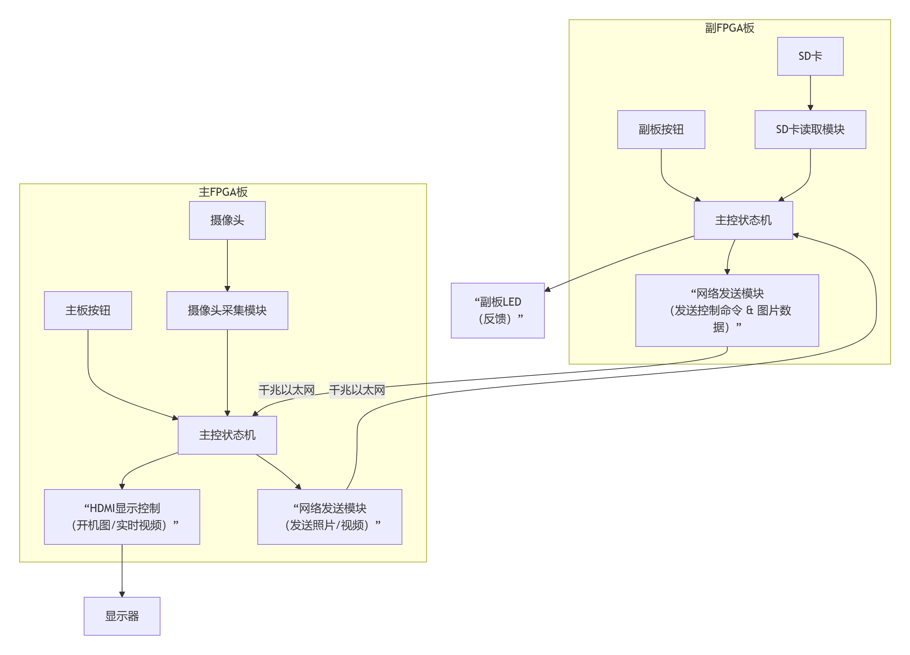

---

**主fpga板：

控制模块：
运行主程序，协调摄像头采集、图像显示、与副板通信

图像处理模块：
通过摄像头采集图像，通过dmhi传输再显示屏上显示图像

通信模块：
通过以太网接收副板（模拟pc）的指令，图像及视频，向副板发送图像及视频

交互模块：
按下按钮拍照，录视频功能

---
**副fpga板：

控制模块：
运行主程序，响应按钮、协调网络通信、控制SD卡存储

数据处理模块：
控制SD卡，接收并存储来自主板的图片/视频文件，读取sd卡图片内容并传输

通信模块：
通过以太网向主板发送控制指令及信息，并接收主板发来的媒体数据

交互模块：
下拨按钮启动相机，控制LED灯，反馈指令接收和数据存储状态

